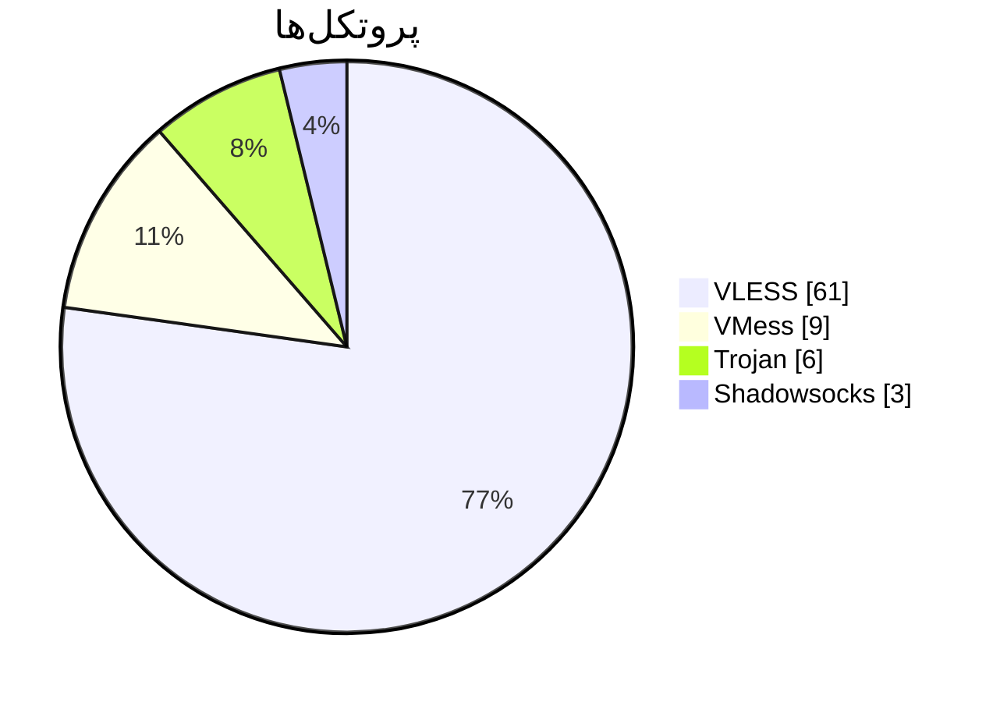

# 🛰️ V2Ray Config Collector

جمع‌آوری خودکار کانفیگ‌های V2Ray از کانال‌های عمومی تلگرام — به‌روزرسانی هر ۵ ساعت

  

`⏱️ آخرین به‌روزرسانی: 2026-06-07 10:53 UTC`

## 📡 لینک‌های اشتراک (Subscription)

| دسته | تعداد | لینک اشتراک (Base64) | متن خام |
|:-----|:----:|:---------------------|:------:|
| 🌐 همه | `79` | `https://raw.githubusercontent.com/Arian-Alijani/tg-v2ray-collector/master/sub/all_b64.txt` | [↧](https://raw.githubusercontent.com/Arian-Alijani/tg-v2ray-collector/master/sub/all.txt) |
| 🟢 VMess | `9` | `https://raw.githubusercontent.com/Arian-Alijani/tg-v2ray-collector/master/sub/vmess_b64.txt` | [↧](https://raw.githubusercontent.com/Arian-Alijani/tg-v2ray-collector/master/sub/vmess.txt) |
| ⚡ VLESS | `61` | `https://raw.githubusercontent.com/Arian-Alijani/tg-v2ray-collector/master/sub/vless_b64.txt` | [↧](https://raw.githubusercontent.com/Arian-Alijani/tg-v2ray-collector/master/sub/vless.txt) |
| 🛡️ Reality | `11` | `https://raw.githubusercontent.com/Arian-Alijani/tg-v2ray-collector/master/sub/reality_b64.txt` | [↧](https://raw.githubusercontent.com/Arian-Alijani/tg-v2ray-collector/master/sub/reality.txt) |
| 🐴 Trojan | `6` | `https://raw.githubusercontent.com/Arian-Alijani/tg-v2ray-collector/master/sub/trojan_b64.txt` | [↧](https://raw.githubusercontent.com/Arian-Alijani/tg-v2ray-collector/master/sub/trojan.txt) |
| 🔒 Shadowsocks | `3` | `https://raw.githubusercontent.com/Arian-Alijani/tg-v2ray-collector/master/sub/shadowsocks_b64.txt` | [↧](https://raw.githubusercontent.com/Arian-Alijani/tg-v2ray-collector/master/sub/shadowsocks.txt) |

> لینک ستون **«اشتراک»** را کپی و در کلاینت خود (v2rayNG، NekoBox، Hiddify، Streisand و …) به‌عنوان Subscription وارد کنید.

## 📊 توزیع پروتکل‌ها

## 🌍 توزیع کشورها

| کشور | تعداد | نمودار |
|:-----|:----:|:-------|
| 🇨🇦 CA | `22` | `██████████████████` |
| 🇳🇱 NL | `8` | `███████` |
| 🇮🇷 IR | `8` | `███████` |
| 🇩🇪 DE | `7` | `██████` |
| 🇮🇹 IT | `7` | `██████` |
| 🇸🇨 SC | `4` | `███` |
| 🇫🇷 FR | `3` | `██` |
| 🇯🇵 JP | `2` | `██` |
| 🇮🇪 IE | `2` | `██` |
| 🇺🇸 US | `2` | `██` |
| 🇪🇸 ES | `2` | `██` |
| 🇭🇰 HK | `2` | `██` |

## 📥 کانال‌ها

| کانال | تعداد کانفیگ |
|:------|:-----------:|
| [@FreeConfigForYou](https://t.me/FreeConfigForYou) | `3` |
| [@V2rayng_Fast](https://t.me/V2rayng_Fast) | `3` |
| [@V2All](https://t.me/V2All) | `3` |
| [@SOSkeyNET](https://t.me/SOSkeyNET) | `3` |
| [@APPXA](https://t.me/APPXA) | `3` |
| [@v2ray_dalghak](https://t.me/v2ray_dalghak) | `3` |
| [@configV2rayForFree](https://t.me/configV2rayForFree) | `3` |
| [@FreakConfig](https://t.me/FreakConfig) | `3` |
| [@bored_vpn](https://t.me/bored_vpn) | `3` |
| [@Ablnet7](https://t.me/Ablnet7) | `3` |
| [@proxy48](https://t.me/proxy48) | `3` |
| [@UnlimitedDev](https://t.me/UnlimitedDev) | `3` |
| [@Parsashonam](https://t.me/Parsashonam) | `3` |
| [@v2rayTG](https://t.me/v2rayTG) | `3` |
| [@vpnplusee_free](https://t.me/vpnplusee_free) | `3` |
| [@fast78_channel](https://t.me/fast78_channel) | `3` |
| [@JKVPN](https://t.me/JKVPN) | `3` |
| [@SimChin_ir](https://t.me/SimChin_ir) | `3` |
| [@v2riran](https://t.me/v2riran) | `3` |
| [@Farah_VPN](https://t.me/Farah_VPN) | `3` |
| [@V2raysCollector](https://t.me/V2raysCollector) | `3` |
| [@narcod_ping](https://t.me/narcod_ping) | `3` |
| [@IRAN_access](https://t.me/IRAN_access) | `3` |
| [@payam_nsi](https://t.me/payam_nsi) | `3` |
| [@V2RAYROZ](https://t.me/V2RAYROZ) | `3` |
| [@Ln2Ray](https://t.me/Ln2Ray) | `2` |
| [@daily_configs](https://t.me/daily_configs) | `1` |
| [@v2ray03](https://t.me/v2ray03) | `1` |

---

🤖 ساخته‌شده به‌صورت خودکار با GitHub Actions • هر ۵ ساعت به‌روزرسانی می‌شود

