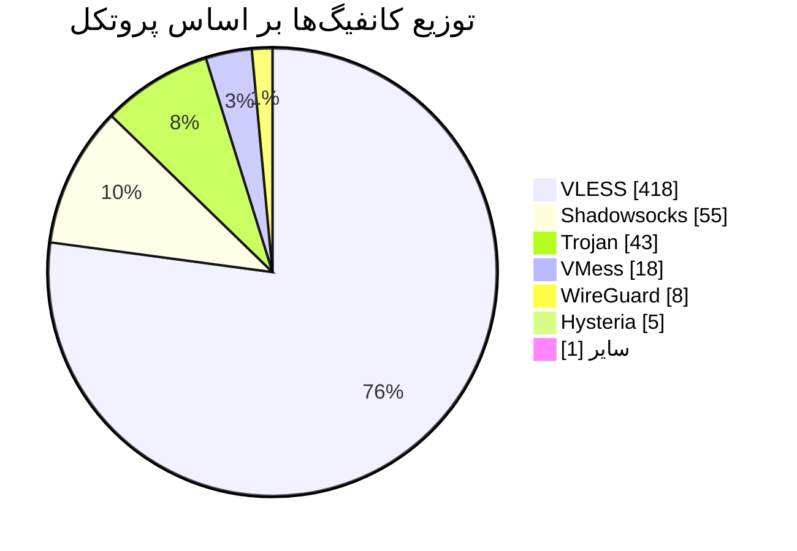

<div align="center">

# 🛰️ V2Ray Config Collector

**جمع‌آوری خودکار کانفیگ‌های V2Ray از کانال‌های عمومی تلگرام**

<sub>بدون نیاز به لاگین یا API • به‌روزرسانی خودکار هر ۵ ساعت با GitHub Actions</sub>

   

`⏱️ آخرین به‌روزرسانی: 2026-08-04 12:02 UTC`

</div>

## 🚀 شروع سریع

لینک اشتراکِ **همه‌ی** کانفیگ‌ها را کپی کرده و در کلاینت خود وارد کنید (پیشنهادی برای اکثر کاربران):

```text
https://raw.githubusercontent.com/Arian-Alijani/Somthing/master/sub/all_b64.txt
```

<div align="center">


<sub>📷 برای افزودنِ سریع، این کد را در کلاینت اسکن کنید</sub>

</div>

## 📡 لینک‌های اشتراک به تفکیک دسته

| دسته | تعداد | لینک اشتراک (Base64) | متن خام |
|:-----|:----:|:---------------------|:------:|
| 🌐 **همه** | `548` | `https://raw.githubusercontent.com/Arian-Alijani/Somthing/master/sub/all_b64.txt` | [⬇️ خام](https://raw.githubusercontent.com/Arian-Alijani/Somthing/master/sub/all.txt) |
| 🟢 **VMess** | `18` | `https://raw.githubusercontent.com/Arian-Alijani/Somthing/master/sub/vmess_b64.txt` | [⬇️ خام](https://raw.githubusercontent.com/Arian-Alijani/Somthing/master/sub/vmess.txt) |
| ⚡ **VLESS** | `418` | `https://raw.githubusercontent.com/Arian-Alijani/Somthing/master/sub/vless_b64.txt` | [⬇️ خام](https://raw.githubusercontent.com/Arian-Alijani/Somthing/master/sub/vless.txt) |
| 🛡️ **Reality** | `86` | `https://raw.githubusercontent.com/Arian-Alijani/Somthing/master/sub/reality_b64.txt` | [⬇️ خام](https://raw.githubusercontent.com/Arian-Alijani/Somthing/master/sub/reality.txt) |
| 🐴 **Trojan** | `43` | `https://raw.githubusercontent.com/Arian-Alijani/Somthing/master/sub/trojan_b64.txt` | [⬇️ خام](https://raw.githubusercontent.com/Arian-Alijani/Somthing/master/sub/trojan.txt) |
| 🔒 **Shadowsocks** | `55` | `https://raw.githubusercontent.com/Arian-Alijani/Somthing/master/sub/shadowsocks_b64.txt` | [⬇️ خام](https://raw.githubusercontent.com/Arian-Alijani/Somthing/master/sub/shadowsocks.txt) |
| 🚀 **Hysteria** | `5` | `https://raw.githubusercontent.com/Arian-Alijani/Somthing/master/sub/hysteria_b64.txt` | [⬇️ خام](https://raw.githubusercontent.com/Arian-Alijani/Somthing/master/sub/hysteria.txt) |
| 🪱 **WireGuard** | `8` | `https://raw.githubusercontent.com/Arian-Alijani/Somthing/master/sub/wireguard_b64.txt` | [⬇️ خام](https://raw.githubusercontent.com/Arian-Alijani/Somthing/master/sub/wireguard.txt) |
| 📦 **سایر** | `1` | `https://raw.githubusercontent.com/Arian-Alijani/Somthing/master/sub/others_b64.txt` | [⬇️ خام](https://raw.githubusercontent.com/Arian-Alijani/Somthing/master/sub/others.txt) |

> 💡 محتوای ستون **«لینک اشتراک (Base64)»** را کپی و در بخش *Subscription / اشتراک* کلاینت خود وارد کنید.

## 📊 توزیع پروتکل‌ها


```mermaid
pie showData
    title توزیع کانفیگ‌ها بر اساس پروتکل
    "VLESS" : 418
    "Shadowsocks" : 55
    "Trojan" : 43
    "VMess" : 18
    "WireGuard" : 8
    "Hysteria" : 5
    "سایر" : 1
```

## 🌍 توزیع کشورها

| کشور | تعداد | سهم |
|:-----|:----:|:----|
| 🇨🇦 `CA` | `137` | `████████████████████` |
| 🇺🇸 `US` | `70` | `██████████░░░░░░░░░░` |
| 🇩🇪 `DE` | `52` | `████████░░░░░░░░░░░░` |
| 🇳🇱 `NL` | `42` | `██████░░░░░░░░░░░░░░` |
| 🇨🇭 `CH` | `25` | `████░░░░░░░░░░░░░░░░` |
| 🇮🇷 `IR` | `23` | `███░░░░░░░░░░░░░░░░░` |
| 🇫🇮 `FI` | `17` | `██░░░░░░░░░░░░░░░░░░` |
| 🇫🇷 `FR` | `16` | `██░░░░░░░░░░░░░░░░░░` |
| 🇬🇧 `GB` | `15` | `██░░░░░░░░░░░░░░░░░░` |
| 🇷🇺 `RU` | `14` | `██░░░░░░░░░░░░░░░░░░` |
| 🇭🇰 `HK` | `10` | `█░░░░░░░░░░░░░░░░░░░` |
| 🇵🇱 `PL` | `10` | `█░░░░░░░░░░░░░░░░░░░` |
| … | `+27` | `سایر کشورها` |

## 📥 منابع (کانال‌های تلگرام)

<details>
<summary>📋 مشاهده‌ی فهرست کامل — 33 کانال</summary>

| # | کانال | تعداد کانفیگ |
|:-:|:------|:-----------:|
| 1 | [@APPXA](https://t.me/APPXA) | `20` |
| 2 | [@Farah_VPN](https://t.me/Farah_VPN) | `20` |
| 3 | [@FreeConfigForYou](https://t.me/FreeConfigForYou) | `20` |
| 4 | [@IRAN_access](https://t.me/IRAN_access) | `20` |
| 5 | [@JKVPN](https://t.me/JKVPN) | `20` |
| 6 | [@Parsashonam](https://t.me/Parsashonam) | `20` |
| 7 | [@UnlimitedDev](https://t.me/UnlimitedDev) | `20` |
| 8 | [@V2rayng_Fast](https://t.me/V2rayng_Fast) | `20` |
| 9 | [@configV2rayForFree](https://t.me/configV2rayForFree) | `20` |
| 10 | [@narcod_ping](https://t.me/narcod_ping) | `20` |
| 11 | [@proxy48](https://t.me/proxy48) | `20` |
| 12 | [@prroxyng](https://t.me/prroxyng) | `20` |
| 13 | [@v2rayTG](https://t.me/v2rayTG) | `20` |
| 14 | [@v2riran](https://t.me/v2riran) | `20` |
| 15 | [@NTGreenplus](https://t.me/NTGreenplus) | `19` |
| 16 | [@SimChin_ir](https://t.me/SimChin_ir) | `19` |
| 17 | [@V2All](https://t.me/V2All) | `19` |
| 18 | [@bored_vpn](https://t.me/bored_vpn) | `19` |
| 19 | [@one_shop_official](https://t.me/one_shop_official) | `19` |
| 20 | [@Ablnet7](https://t.me/Ablnet7) | `18` |
| 21 | [@fast78_channel](https://t.me/fast78_channel) | `18` |
| 22 | [@vpnplusee_free](https://t.me/vpnplusee_free) | `18` |
| 23 | [@V2RAYROZ](https://t.me/V2RAYROZ) | `15` |
| 24 | [@payam_nsi](https://t.me/payam_nsi) | `15` |
| 25 | [@v2ray03](https://t.me/v2ray03) | `15` |
| 26 | [@SOSkeyNET](https://t.me/SOSkeyNET) | `13` |
| 27 | [@daily_configs](https://t.me/daily_configs) | `13` |
| 28 | [@planB_net](https://t.me/planB_net) | `12` |
| 29 | [@Ln2Ray](https://t.me/Ln2Ray) | `10` |
| 30 | [@V2raysCollector](https://t.me/V2raysCollector) | `10` |
| 31 | [@FreakConfig](https://t.me/FreakConfig) | `7` |
| 32 | [@v2ray_dalghak](https://t.me/v2ray_dalghak) | `7` |
| 33 | [@V2RAY_VMESS_free](https://t.me/V2RAY_VMESS_free) | `2` |

</details>

## 📱 نحوه‌ی استفاده

۱. لینکِ اشتراکِ دسته‌ی دلخواه (ستون Base64) را کپی کنید.

۲. در کلاینت، بخشِ **Subscription / اشتراک** را باز کرده و لینک را اضافه کنید.

۳. اشتراک را **Update** کنید تا کانفیگ‌ها بارگذاری شوند.

کلاینت‌های پیشنهادی: **v2rayNG** · **NekoBox** · **Hiddify** · **Streisand** · **Shadowrocket**

---
<div align="center">

<sub>🤖 ساخته‌شده به‌صورت خودکار با GitHub Actions • هر ۵ ساعت به‌روزرسانی می‌شود</sub>

<sub>⚠️ این کانفیگ‌ها از منابع عمومی جمع‌آوری شده‌اند و صرفاً برای آزمایش و دسترسی آزاد به اینترنت‌اند.</sub>

</div>
