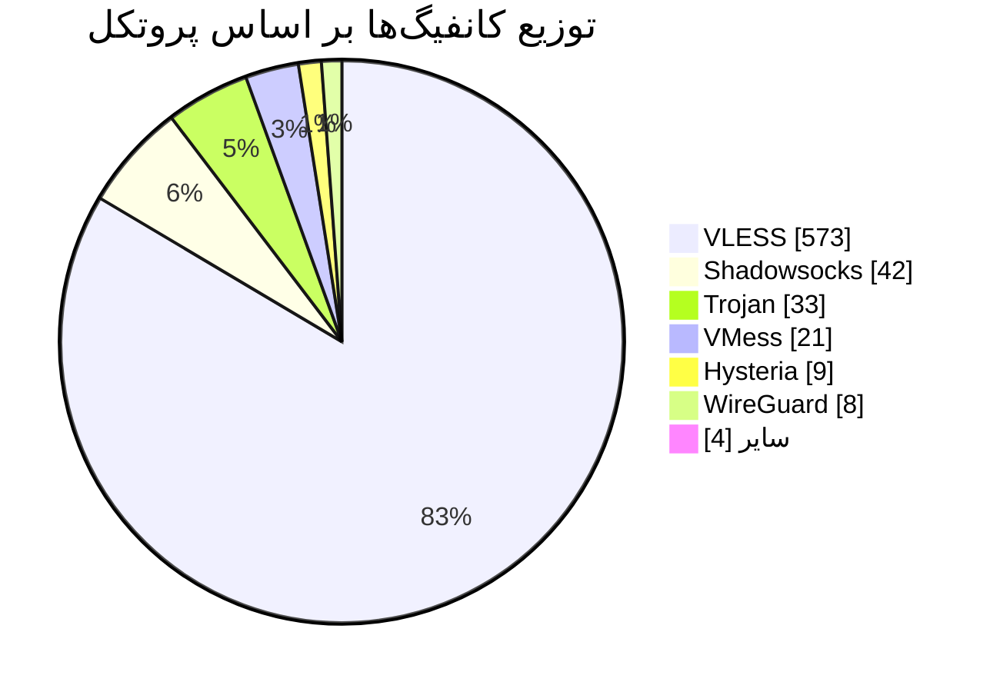

<div align="center">

# 🛰️ V2Ray Config Collector

**جمع‌آوری خودکار کانفیگ‌های V2Ray از کانال‌های عمومی تلگرام**

<sub>بدون نیاز به لاگین یا API • به‌روزرسانی خودکار هر ۵ ساعت با GitHub Actions</sub>

   

`⏱️ آخرین به‌روزرسانی: 2026-09-03 08:57 UTC`

</div>

## 🚀 شروع سریع

لینک اشتراکِ **همه‌ی** کانفیگ‌ها را کپی کرده و در کلاینت خود وارد کنید (پیشنهادی برای اکثر کاربران):

```text
https://raw.githubusercontent.com/Arian-Alijani/Somthing/master/sub/all_b64.txt
```

<div align="center">


<sub>📷 برای افزودنِ سریع، این کد را در کلاینت اسکن کنید</sub>

</div>

## 📡 لینک‌های اشتراک به تفکیک دسته

| دسته | تعداد | لینک اشتراک (Base64) | متن خام |
|:-----|:----:|:---------------------|:------:|
| 🌐 **همه** | `690` | `https://raw.githubusercontent.com/Arian-Alijani/Somthing/master/sub/all_b64.txt` | [⬇️ خام](https://raw.githubusercontent.com/Arian-Alijani/Somthing/master/sub/all.txt) |
| 🟢 **VMess** | `21` | `https://raw.githubusercontent.com/Arian-Alijani/Somthing/master/sub/vmess_b64.txt` | [⬇️ خام](https://raw.githubusercontent.com/Arian-Alijani/Somthing/master/sub/vmess.txt) |
| ⚡ **VLESS** | `573` | `https://raw.githubusercontent.com/Arian-Alijani/Somthing/master/sub/vless_b64.txt` | [⬇️ خام](https://raw.githubusercontent.com/Arian-Alijani/Somthing/master/sub/vless.txt) |
| 🛡️ **Reality** | `168` | `https://raw.githubusercontent.com/Arian-Alijani/Somthing/master/sub/reality_b64.txt` | [⬇️ خام](https://raw.githubusercontent.com/Arian-Alijani/Somthing/master/sub/reality.txt) |
| 🐴 **Trojan** | `33` | `https://raw.githubusercontent.com/Arian-Alijani/Somthing/master/sub/trojan_b64.txt` | [⬇️ خام](https://raw.githubusercontent.com/Arian-Alijani/Somthing/master/sub/trojan.txt) |
| 🔒 **Shadowsocks** | `42` | `https://raw.githubusercontent.com/Arian-Alijani/Somthing/master/sub/shadowsocks_b64.txt` | [⬇️ خام](https://raw.githubusercontent.com/Arian-Alijani/Somthing/master/sub/shadowsocks.txt) |
| 🚀 **Hysteria** | `9` | `https://raw.githubusercontent.com/Arian-Alijani/Somthing/master/sub/hysteria_b64.txt` | [⬇️ خام](https://raw.githubusercontent.com/Arian-Alijani/Somthing/master/sub/hysteria.txt) |
| 🪱 **WireGuard** | `8` | `https://raw.githubusercontent.com/Arian-Alijani/Somthing/master/sub/wireguard_b64.txt` | [⬇️ خام](https://raw.githubusercontent.com/Arian-Alijani/Somthing/master/sub/wireguard.txt) |
| 📦 **سایر** | `4` | `https://raw.githubusercontent.com/Arian-Alijani/Somthing/master/sub/others_b64.txt` | [⬇️ خام](https://raw.githubusercontent.com/Arian-Alijani/Somthing/master/sub/others.txt) |

> 💡 محتوای ستون **«لینک اشتراک (Base64)»** را کپی و در بخش *Subscription / اشتراک* کلاینت خود وارد کنید.

## 📊 توزیع پروتکل‌ها


```mermaid
pie showData
    title توزیع کانفیگ‌ها بر اساس پروتکل
    "VLESS" : 573
    "Shadowsocks" : 42
    "Trojan" : 33
    "VMess" : 21
    "Hysteria" : 9
    "WireGuard" : 8
    "سایر" : 4
```

## 🌍 توزیع کشورها

| کشور | تعداد | سهم |
|:-----|:----:|:----|
| 🇨🇦 `CA` | `152` | `████████████████████` |
| 🇺🇸 `US` | `94` | `████████████░░░░░░░░` |
| 🇩🇪 `DE` | `78` | `██████████░░░░░░░░░░` |
| 🇳🇱 `NL` | `49` | `██████░░░░░░░░░░░░░░` |
| 🇮🇷 `IR` | `35` | `█████░░░░░░░░░░░░░░░` |
| 🇹🇷 `TR` | `25` | `███░░░░░░░░░░░░░░░░░` |
| 🇬🇧 `GB` | `24` | `███░░░░░░░░░░░░░░░░░` |
| 🇫🇷 `FR` | `17` | `██░░░░░░░░░░░░░░░░░░` |
| 🇷🇺 `RU` | `15` | `██░░░░░░░░░░░░░░░░░░` |
| 🇧🇬 `BG` | `14` | `██░░░░░░░░░░░░░░░░░░` |
| 🇸🇬 `SG` | `14` | `██░░░░░░░░░░░░░░░░░░` |
| 🇫🇮 `FI` | `13` | `██░░░░░░░░░░░░░░░░░░` |
| … | `+33` | `سایر کشورها` |

## 🌐 لینک اشتراکِ اختصاصیِ هر کشور

هر کشور یک لینک اشتراکِ **مستقل** دارد؛ یعنی می‌توانید فقط کانفیگ‌های یک کشور مشخص (مثلاً فقط 🇫🇷 فرانسه یا فقط 🇩🇪 آلمان) را در کلاینت خود اضافه کنید، بدون این‌که کانفیگ‌های سایر کشورها بیاید.

<details>
<summary>📋 مشاهده‌ی جدولِ لینک‌ها — 45 کشور</summary>

| کشور | تعداد | لینک اشتراک (Base64) | متن خام |
|:-----|:----:|:---------------------|:------:|
| 🇨🇦 **CA** | `152` | `https://raw.githubusercontent.com/Arian-Alijani/Somthing/master/sub/country/ca_b64.txt` | [⬇️ خام](https://raw.githubusercontent.com/Arian-Alijani/Somthing/master/sub/country/ca.txt) |
| 🇺🇸 **US** | `94` | `https://raw.githubusercontent.com/Arian-Alijani/Somthing/master/sub/country/us_b64.txt` | [⬇️ خام](https://raw.githubusercontent.com/Arian-Alijani/Somthing/master/sub/country/us.txt) |
| 🇩🇪 **DE** | `78` | `https://raw.githubusercontent.com/Arian-Alijani/Somthing/master/sub/country/de_b64.txt` | [⬇️ خام](https://raw.githubusercontent.com/Arian-Alijani/Somthing/master/sub/country/de.txt) |
| 🇳🇱 **NL** | `49` | `https://raw.githubusercontent.com/Arian-Alijani/Somthing/master/sub/country/nl_b64.txt` | [⬇️ خام](https://raw.githubusercontent.com/Arian-Alijani/Somthing/master/sub/country/nl.txt) |
| 🇮🇷 **IR** | `35` | `https://raw.githubusercontent.com/Arian-Alijani/Somthing/master/sub/country/ir_b64.txt` | [⬇️ خام](https://raw.githubusercontent.com/Arian-Alijani/Somthing/master/sub/country/ir.txt) |
| 🇹🇷 **TR** | `25` | `https://raw.githubusercontent.com/Arian-Alijani/Somthing/master/sub/country/tr_b64.txt` | [⬇️ خام](https://raw.githubusercontent.com/Arian-Alijani/Somthing/master/sub/country/tr.txt) |
| 🇬🇧 **GB** | `24` | `https://raw.githubusercontent.com/Arian-Alijani/Somthing/master/sub/country/gb_b64.txt` | [⬇️ خام](https://raw.githubusercontent.com/Arian-Alijani/Somthing/master/sub/country/gb.txt) |
| 🇫🇷 **FR** | `17` | `https://raw.githubusercontent.com/Arian-Alijani/Somthing/master/sub/country/fr_b64.txt` | [⬇️ خام](https://raw.githubusercontent.com/Arian-Alijani/Somthing/master/sub/country/fr.txt) |
| 🇷🇺 **RU** | `15` | `https://raw.githubusercontent.com/Arian-Alijani/Somthing/master/sub/country/ru_b64.txt` | [⬇️ خام](https://raw.githubusercontent.com/Arian-Alijani/Somthing/master/sub/country/ru.txt) |
| 🇧🇬 **BG** | `14` | `https://raw.githubusercontent.com/Arian-Alijani/Somthing/master/sub/country/bg_b64.txt` | [⬇️ خام](https://raw.githubusercontent.com/Arian-Alijani/Somthing/master/sub/country/bg.txt) |
| 🇸🇬 **SG** | `14` | `https://raw.githubusercontent.com/Arian-Alijani/Somthing/master/sub/country/sg_b64.txt` | [⬇️ خام](https://raw.githubusercontent.com/Arian-Alijani/Somthing/master/sub/country/sg.txt) |
| 🇫🇮 **FI** | `13` | `https://raw.githubusercontent.com/Arian-Alijani/Somthing/master/sub/country/fi_b64.txt` | [⬇️ خام](https://raw.githubusercontent.com/Arian-Alijani/Somthing/master/sub/country/fi.txt) |
| 🇷🇸 **RS** | `12` | `https://raw.githubusercontent.com/Arian-Alijani/Somthing/master/sub/country/rs_b64.txt` | [⬇️ خام](https://raw.githubusercontent.com/Arian-Alijani/Somthing/master/sub/country/rs.txt) |
| 🇨🇭 **CH** | `10` | `https://raw.githubusercontent.com/Arian-Alijani/Somthing/master/sub/country/ch_b64.txt` | [⬇️ خام](https://raw.githubusercontent.com/Arian-Alijani/Somthing/master/sub/country/ch.txt) |
| 🇯🇵 **JP** | `9` | `https://raw.githubusercontent.com/Arian-Alijani/Somthing/master/sub/country/jp_b64.txt` | [⬇️ خام](https://raw.githubusercontent.com/Arian-Alijani/Somthing/master/sub/country/jp.txt) |
| 🇭🇰 **HK** | `7` | `https://raw.githubusercontent.com/Arian-Alijani/Somthing/master/sub/country/hk_b64.txt` | [⬇️ خام](https://raw.githubusercontent.com/Arian-Alijani/Somthing/master/sub/country/hk.txt) |
| 🇲🇩 **MD** | `6` | `https://raw.githubusercontent.com/Arian-Alijani/Somthing/master/sub/country/md_b64.txt` | [⬇️ خام](https://raw.githubusercontent.com/Arian-Alijani/Somthing/master/sub/country/md.txt) |
| 🇮🇹 **IT** | `5` | `https://raw.githubusercontent.com/Arian-Alijani/Somthing/master/sub/country/it_b64.txt` | [⬇️ خام](https://raw.githubusercontent.com/Arian-Alijani/Somthing/master/sub/country/it.txt) |
| 🇳🇴 **NO** | `5` | `https://raw.githubusercontent.com/Arian-Alijani/Somthing/master/sub/country/no_b64.txt` | [⬇️ خام](https://raw.githubusercontent.com/Arian-Alijani/Somthing/master/sub/country/no.txt) |
| 🇵🇱 **PL** | `5` | `https://raw.githubusercontent.com/Arian-Alijani/Somthing/master/sub/country/pl_b64.txt` | [⬇️ خام](https://raw.githubusercontent.com/Arian-Alijani/Somthing/master/sub/country/pl.txt) |
| 🇸🇨 **SC** | `5` | `https://raw.githubusercontent.com/Arian-Alijani/Somthing/master/sub/country/sc_b64.txt` | [⬇️ خام](https://raw.githubusercontent.com/Arian-Alijani/Somthing/master/sub/country/sc.txt) |
| 🇦🇪 **AE** | `4` | `https://raw.githubusercontent.com/Arian-Alijani/Somthing/master/sub/country/ae_b64.txt` | [⬇️ خام](https://raw.githubusercontent.com/Arian-Alijani/Somthing/master/sub/country/ae.txt) |
| 🇰🇿 **KZ** | `3` | `https://raw.githubusercontent.com/Arian-Alijani/Somthing/master/sub/country/kz_b64.txt` | [⬇️ خام](https://raw.githubusercontent.com/Arian-Alijani/Somthing/master/sub/country/kz.txt) |
| 🇸🇪 **SE** | `3` | `https://raw.githubusercontent.com/Arian-Alijani/Somthing/master/sub/country/se_b64.txt` | [⬇️ خام](https://raw.githubusercontent.com/Arian-Alijani/Somthing/master/sub/country/se.txt) |
| 🇹🇼 **TW** | `3` | `https://raw.githubusercontent.com/Arian-Alijani/Somthing/master/sub/country/tw_b64.txt` | [⬇️ خام](https://raw.githubusercontent.com/Arian-Alijani/Somthing/master/sub/country/tw.txt) |
| 🇪🇪 **EE** | `2` | `https://raw.githubusercontent.com/Arian-Alijani/Somthing/master/sub/country/ee_b64.txt` | [⬇️ خام](https://raw.githubusercontent.com/Arian-Alijani/Somthing/master/sub/country/ee.txt) |
| 🇰🇷 **KR** | `2` | `https://raw.githubusercontent.com/Arian-Alijani/Somthing/master/sub/country/kr_b64.txt` | [⬇️ خام](https://raw.githubusercontent.com/Arian-Alijani/Somthing/master/sub/country/kr.txt) |
| 🇱🇻 **LV** | `2` | `https://raw.githubusercontent.com/Arian-Alijani/Somthing/master/sub/country/lv_b64.txt` | [⬇️ خام](https://raw.githubusercontent.com/Arian-Alijani/Somthing/master/sub/country/lv.txt) |
| 🇺🇿 **UZ** | `2` | `https://raw.githubusercontent.com/Arian-Alijani/Somthing/master/sub/country/uz_b64.txt` | [⬇️ خام](https://raw.githubusercontent.com/Arian-Alijani/Somthing/master/sub/country/uz.txt) |
| 🇦🇹 **AT** | `1` | `https://raw.githubusercontent.com/Arian-Alijani/Somthing/master/sub/country/at_b64.txt` | [⬇️ خام](https://raw.githubusercontent.com/Arian-Alijani/Somthing/master/sub/country/at.txt) |
| 🇧🇷 **BR** | `1` | `https://raw.githubusercontent.com/Arian-Alijani/Somthing/master/sub/country/br_b64.txt` | [⬇️ خام](https://raw.githubusercontent.com/Arian-Alijani/Somthing/master/sub/country/br.txt) |
| 🇧🇿 **BZ** | `1` | `https://raw.githubusercontent.com/Arian-Alijani/Somthing/master/sub/country/bz_b64.txt` | [⬇️ خام](https://raw.githubusercontent.com/Arian-Alijani/Somthing/master/sub/country/bz.txt) |
| 🇨🇳 **CN** | `1` | `https://raw.githubusercontent.com/Arian-Alijani/Somthing/master/sub/country/cn_b64.txt` | [⬇️ خام](https://raw.githubusercontent.com/Arian-Alijani/Somthing/master/sub/country/cn.txt) |
| 🇨🇷 **CR** | `1` | `https://raw.githubusercontent.com/Arian-Alijani/Somthing/master/sub/country/cr_b64.txt` | [⬇️ خام](https://raw.githubusercontent.com/Arian-Alijani/Somthing/master/sub/country/cr.txt) |
| 🇪🇸 **ES** | `1` | `https://raw.githubusercontent.com/Arian-Alijani/Somthing/master/sub/country/es_b64.txt` | [⬇️ خام](https://raw.githubusercontent.com/Arian-Alijani/Somthing/master/sub/country/es.txt) |
| 🇬🇪 **GE** | `1` | `https://raw.githubusercontent.com/Arian-Alijani/Somthing/master/sub/country/ge_b64.txt` | [⬇️ خام](https://raw.githubusercontent.com/Arian-Alijani/Somthing/master/sub/country/ge.txt) |
| 🇭🇷 **HR** | `1` | `https://raw.githubusercontent.com/Arian-Alijani/Somthing/master/sub/country/hr_b64.txt` | [⬇️ خام](https://raw.githubusercontent.com/Arian-Alijani/Somthing/master/sub/country/hr.txt) |
| 🇮🇪 **IE** | `1` | `https://raw.githubusercontent.com/Arian-Alijani/Somthing/master/sub/country/ie_b64.txt` | [⬇️ خام](https://raw.githubusercontent.com/Arian-Alijani/Somthing/master/sub/country/ie.txt) |
| 🇮🇱 **IL** | `1` | `https://raw.githubusercontent.com/Arian-Alijani/Somthing/master/sub/country/il_b64.txt` | [⬇️ خام](https://raw.githubusercontent.com/Arian-Alijani/Somthing/master/sub/country/il.txt) |
| 🇮🇳 **IN** | `1` | `https://raw.githubusercontent.com/Arian-Alijani/Somthing/master/sub/country/in_b64.txt` | [⬇️ خام](https://raw.githubusercontent.com/Arian-Alijani/Somthing/master/sub/country/in.txt) |
| 🇱🇹 **LT** | `1` | `https://raw.githubusercontent.com/Arian-Alijani/Somthing/master/sub/country/lt_b64.txt` | [⬇️ خام](https://raw.githubusercontent.com/Arian-Alijani/Somthing/master/sub/country/lt.txt) |
| 🇲🇾 **MY** | `1` | `https://raw.githubusercontent.com/Arian-Alijani/Somthing/master/sub/country/my_b64.txt` | [⬇️ خام](https://raw.githubusercontent.com/Arian-Alijani/Somthing/master/sub/country/my.txt) |
| 🇸🇦 **SA** | `1` | `https://raw.githubusercontent.com/Arian-Alijani/Somthing/master/sub/country/sa_b64.txt` | [⬇️ خام](https://raw.githubusercontent.com/Arian-Alijani/Somthing/master/sub/country/sa.txt) |
| 🇺🇦 **UA** | `1` | `https://raw.githubusercontent.com/Arian-Alijani/Somthing/master/sub/country/ua_b64.txt` | [⬇️ خام](https://raw.githubusercontent.com/Arian-Alijani/Somthing/master/sub/country/ua.txt) |
| 🇿🇦 **ZA** | `1` | `https://raw.githubusercontent.com/Arian-Alijani/Somthing/master/sub/country/za_b64.txt` | [⬇️ خام](https://raw.githubusercontent.com/Arian-Alijani/Somthing/master/sub/country/za.txt) |

</details>

> 💡 لینک ستون **«لینک اشتراک (Base64)»** ردیفِ کشورِ دلخواه را کپی و در بخش *Subscription / اشتراک* کلاینت خود وارد کنید.

## 📥 منابع (کانال‌های تلگرام)

<details>
<summary>📋 مشاهده‌ی فهرست کامل — 33 کانال</summary>

| # | کانال | تعداد کانفیگ |
|:-:|:------|:-----------:|
| 1 | [@Ablnet7](https://t.me/Ablnet7) | `25` |
| 2 | [@Farah_VPN](https://t.me/Farah_VPN) | `25` |
| 3 | [@FreakConfig](https://t.me/FreakConfig) | `25` |
| 4 | [@FreeConfigForYou](https://t.me/FreeConfigForYou) | `25` |
| 5 | [@IRAN_access](https://t.me/IRAN_access) | `25` |
| 6 | [@JKVPN](https://t.me/JKVPN) | `25` |
| 7 | [@Parsashonam](https://t.me/Parsashonam) | `25` |
| 8 | [@SimChin_ir](https://t.me/SimChin_ir) | `25` |
| 9 | [@UnlimitedDev](https://t.me/UnlimitedDev) | `25` |
| 10 | [@V2All](https://t.me/V2All) | `25` |
| 11 | [@V2rayng_Fast](https://t.me/V2rayng_Fast) | `25` |
| 12 | [@bored_vpn](https://t.me/bored_vpn) | `25` |
| 13 | [@configV2rayForFree](https://t.me/configV2rayForFree) | `25` |
| 14 | [@fast78_channel](https://t.me/fast78_channel) | `25` |
| 15 | [@narcod_ping](https://t.me/narcod_ping) | `25` |
| 16 | [@one_shop_official](https://t.me/one_shop_official) | `25` |
| 17 | [@proxy48](https://t.me/proxy48) | `25` |
| 18 | [@v2ray03](https://t.me/v2ray03) | `25` |
| 19 | [@v2rayTG](https://t.me/v2rayTG) | `25` |
| 20 | [@v2riran](https://t.me/v2riran) | `25` |
| 21 | [@prroxyng](https://t.me/prroxyng) | `24` |
| 22 | [@NTGreenplus](https://t.me/NTGreenplus) | `23` |
| 23 | [@payam_nsi](https://t.me/payam_nsi) | `23` |
| 24 | [@vpnplusee_free](https://t.me/vpnplusee_free) | `23` |
| 25 | [@planB_net](https://t.me/planB_net) | `19` |
| 26 | [@daily_configs](https://t.me/daily_configs) | `18` |
| 27 | [@V2RAYROZ](https://t.me/V2RAYROZ) | `15` |
| 28 | [@Ln2Ray](https://t.me/Ln2Ray) | `11` |
| 29 | [@SOSkeyNET](https://t.me/SOSkeyNET) | `9` |
| 30 | [@V2RAY_VMESS_free](https://t.me/V2RAY_VMESS_free) | `9` |
| 31 | [@V2raysCollector](https://t.me/V2raysCollector) | `8` |
| 32 | [@v2ray_dalghak](https://t.me/v2ray_dalghak) | `5` |
| 33 | [@APPXA](https://t.me/APPXA) | `3` |

</details>

## 📱 نحوه‌ی استفاده

۱. لینکِ اشتراکِ دسته‌ی دلخواه (ستون Base64) را کپی کنید.

۲. در کلاینت، بخشِ **Subscription / اشتراک** را باز کرده و لینک را اضافه کنید.

۳. اشتراک را **Update** کنید تا کانفیگ‌ها بارگذاری شوند.

کلاینت‌های پیشنهادی: **v2rayNG** · **NekoBox** · **Hiddify** · **Streisand** · **Shadowrocket**

---
<div align="center">

<sub>🤖 ساخته‌شده به‌صورت خودکار با GitHub Actions • هر ۵ ساعت به‌روزرسانی می‌شود</sub>

<sub>⚠️ این کانفیگ‌ها از منابع عمومی جمع‌آوری شده‌اند و صرفاً برای آزمایش و دسترسی آزاد به اینترنت‌اند.</sub>

</div>
