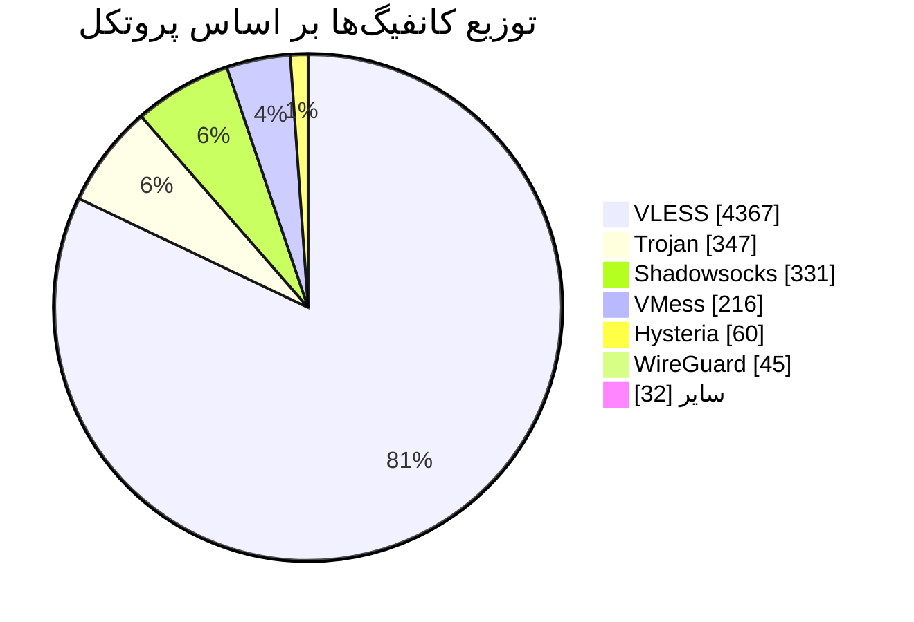

<div align="center">

# 🛰️ V2Ray Config Collector

**جمع‌آوری خودکار کانفیگ‌های V2Ray از کانال‌های عمومی تلگرام**

<sub>بدون نیاز به لاگین یا API • به‌روزرسانی خودکار هر ۵ ساعت با GitHub Actions</sub>

   

`⏱️ آخرین به‌روزرسانی: 2026-08-07 10:26 UTC`

</div>

## 🚀 شروع سریع

لینک اشتراکِ **همه‌ی** کانفیگ‌ها را کپی کرده و در کلاینت خود وارد کنید (پیشنهادی برای اکثر کاربران):

```text
https://raw.githubusercontent.com/Arian-Alijani/Somthing/master/sub/all_b64.txt
```

<div align="center">


<sub>📷 برای افزودنِ سریع، این کد را در کلاینت اسکن کنید</sub>

</div>

## 📡 لینک‌های اشتراک به تفکیک دسته

| دسته | تعداد | لینک اشتراک (Base64) | متن خام |
|:-----|:----:|:---------------------|:------:|
| 🌐 **همه** | `5398` | `https://raw.githubusercontent.com/Arian-Alijani/Somthing/master/sub/all_b64.txt` | [⬇️ خام](https://raw.githubusercontent.com/Arian-Alijani/Somthing/master/sub/all.txt) |
| 🟢 **VMess** | `216` | `https://raw.githubusercontent.com/Arian-Alijani/Somthing/master/sub/vmess_b64.txt` | [⬇️ خام](https://raw.githubusercontent.com/Arian-Alijani/Somthing/master/sub/vmess.txt) |
| ⚡ **VLESS** | `4367` | `https://raw.githubusercontent.com/Arian-Alijani/Somthing/master/sub/vless_b64.txt` | [⬇️ خام](https://raw.githubusercontent.com/Arian-Alijani/Somthing/master/sub/vless.txt) |
| 🛡️ **Reality** | `989` | `https://raw.githubusercontent.com/Arian-Alijani/Somthing/master/sub/reality_b64.txt` | [⬇️ خام](https://raw.githubusercontent.com/Arian-Alijani/Somthing/master/sub/reality.txt) |
| 🐴 **Trojan** | `347` | `https://raw.githubusercontent.com/Arian-Alijani/Somthing/master/sub/trojan_b64.txt` | [⬇️ خام](https://raw.githubusercontent.com/Arian-Alijani/Somthing/master/sub/trojan.txt) |
| 🔒 **Shadowsocks** | `331` | `https://raw.githubusercontent.com/Arian-Alijani/Somthing/master/sub/shadowsocks_b64.txt` | [⬇️ خام](https://raw.githubusercontent.com/Arian-Alijani/Somthing/master/sub/shadowsocks.txt) |
| 🚀 **Hysteria** | `60` | `https://raw.githubusercontent.com/Arian-Alijani/Somthing/master/sub/hysteria_b64.txt` | [⬇️ خام](https://raw.githubusercontent.com/Arian-Alijani/Somthing/master/sub/hysteria.txt) |
| 🪱 **WireGuard** | `45` | `https://raw.githubusercontent.com/Arian-Alijani/Somthing/master/sub/wireguard_b64.txt` | [⬇️ خام](https://raw.githubusercontent.com/Arian-Alijani/Somthing/master/sub/wireguard.txt) |
| 📦 **سایر** | `32` | `https://raw.githubusercontent.com/Arian-Alijani/Somthing/master/sub/others_b64.txt` | [⬇️ خام](https://raw.githubusercontent.com/Arian-Alijani/Somthing/master/sub/others.txt) |

> 💡 محتوای ستون **«لینک اشتراک (Base64)»** را کپی و در بخش *Subscription / اشتراک* کلاینت خود وارد کنید.

## 📊 توزیع پروتکل‌ها


```mermaid
pie showData
    title توزیع کانفیگ‌ها بر اساس پروتکل
    "VLESS" : 4367
    "Trojan" : 347
    "Shadowsocks" : 331
    "VMess" : 216
    "Hysteria" : 60
    "WireGuard" : 45
    "سایر" : 32
```

## 🌍 توزیع کشورها

| کشور | تعداد | سهم |
|:-----|:----:|:----|
| 🇨🇦 `CA` | `1612` | `████████████████████` |
| 🇩🇪 `DE` | `502` | `██████░░░░░░░░░░░░░░` |
| 🇺🇸 `US` | `401` | `█████░░░░░░░░░░░░░░░` |
| 🇮🇷 `IR` | `286` | `████░░░░░░░░░░░░░░░░` |
| 🇳🇱 `NL` | `230` | `███░░░░░░░░░░░░░░░░░` |
| 🇫🇷 `FR` | `169` | `██░░░░░░░░░░░░░░░░░░` |
| 🇬🇧 `GB` | `97` | `█░░░░░░░░░░░░░░░░░░░` |
| 🇫🇮 `FI` | `92` | `█░░░░░░░░░░░░░░░░░░░` |
| 🇷🇺 `RU` | `80` | `█░░░░░░░░░░░░░░░░░░░` |
| 🇹🇷 `TR` | `79` | `█░░░░░░░░░░░░░░░░░░░` |
| 🇨🇭 `CH` | `70` | `█░░░░░░░░░░░░░░░░░░░` |
| 🇸🇪 `SE` | `66` | `█░░░░░░░░░░░░░░░░░░░` |
| … | `+58` | `سایر کشورها` |

## 🌐 لینک اشتراکِ اختصاصیِ هر کشور

هر کشور یک لینک اشتراکِ **مستقل** دارد؛ یعنی می‌توانید فقط کانفیگ‌های یک کشور مشخص (مثلاً فقط 🇫🇷 فرانسه یا فقط 🇩🇪 آلمان) را در کلاینت خود اضافه کنید، بدون این‌که کانفیگ‌های سایر کشورها بیاید.

<details>
<summary>📋 مشاهده‌ی جدولِ لینک‌ها — 70 کشور</summary>

| کشور | تعداد | لینک اشتراک (Base64) | متن خام |
|:-----|:----:|:---------------------|:------:|
| 🇨🇦 **CA** | `1612` | `https://raw.githubusercontent.com/Arian-Alijani/Somthing/master/sub/country/ca_b64.txt` | [⬇️ خام](https://raw.githubusercontent.com/Arian-Alijani/Somthing/master/sub/country/ca.txt) |
| 🇩🇪 **DE** | `502` | `https://raw.githubusercontent.com/Arian-Alijani/Somthing/master/sub/country/de_b64.txt` | [⬇️ خام](https://raw.githubusercontent.com/Arian-Alijani/Somthing/master/sub/country/de.txt) |
| 🇺🇸 **US** | `401` | `https://raw.githubusercontent.com/Arian-Alijani/Somthing/master/sub/country/us_b64.txt` | [⬇️ خام](https://raw.githubusercontent.com/Arian-Alijani/Somthing/master/sub/country/us.txt) |
| 🇮🇷 **IR** | `286` | `https://raw.githubusercontent.com/Arian-Alijani/Somthing/master/sub/country/ir_b64.txt` | [⬇️ خام](https://raw.githubusercontent.com/Arian-Alijani/Somthing/master/sub/country/ir.txt) |
| 🇳🇱 **NL** | `230` | `https://raw.githubusercontent.com/Arian-Alijani/Somthing/master/sub/country/nl_b64.txt` | [⬇️ خام](https://raw.githubusercontent.com/Arian-Alijani/Somthing/master/sub/country/nl.txt) |
| 🇫🇷 **FR** | `169` | `https://raw.githubusercontent.com/Arian-Alijani/Somthing/master/sub/country/fr_b64.txt` | [⬇️ خام](https://raw.githubusercontent.com/Arian-Alijani/Somthing/master/sub/country/fr.txt) |
| 🇬🇧 **GB** | `97` | `https://raw.githubusercontent.com/Arian-Alijani/Somthing/master/sub/country/gb_b64.txt` | [⬇️ خام](https://raw.githubusercontent.com/Arian-Alijani/Somthing/master/sub/country/gb.txt) |
| 🇫🇮 **FI** | `92` | `https://raw.githubusercontent.com/Arian-Alijani/Somthing/master/sub/country/fi_b64.txt` | [⬇️ خام](https://raw.githubusercontent.com/Arian-Alijani/Somthing/master/sub/country/fi.txt) |
| 🇷🇺 **RU** | `80` | `https://raw.githubusercontent.com/Arian-Alijani/Somthing/master/sub/country/ru_b64.txt` | [⬇️ خام](https://raw.githubusercontent.com/Arian-Alijani/Somthing/master/sub/country/ru.txt) |
| 🇹🇷 **TR** | `79` | `https://raw.githubusercontent.com/Arian-Alijani/Somthing/master/sub/country/tr_b64.txt` | [⬇️ خام](https://raw.githubusercontent.com/Arian-Alijani/Somthing/master/sub/country/tr.txt) |
| 🇨🇭 **CH** | `70` | `https://raw.githubusercontent.com/Arian-Alijani/Somthing/master/sub/country/ch_b64.txt` | [⬇️ خام](https://raw.githubusercontent.com/Arian-Alijani/Somthing/master/sub/country/ch.txt) |
| 🇸🇪 **SE** | `66` | `https://raw.githubusercontent.com/Arian-Alijani/Somthing/master/sub/country/se_b64.txt` | [⬇️ خام](https://raw.githubusercontent.com/Arian-Alijani/Somthing/master/sub/country/se.txt) |
| 🇸🇨 **SC** | `58` | `https://raw.githubusercontent.com/Arian-Alijani/Somthing/master/sub/country/sc_b64.txt` | [⬇️ خام](https://raw.githubusercontent.com/Arian-Alijani/Somthing/master/sub/country/sc.txt) |
| 🇮🇹 **IT** | `45` | `https://raw.githubusercontent.com/Arian-Alijani/Somthing/master/sub/country/it_b64.txt` | [⬇️ خام](https://raw.githubusercontent.com/Arian-Alijani/Somthing/master/sub/country/it.txt) |
| 🇯🇵 **JP** | `36` | `https://raw.githubusercontent.com/Arian-Alijani/Somthing/master/sub/country/jp_b64.txt` | [⬇️ خام](https://raw.githubusercontent.com/Arian-Alijani/Somthing/master/sub/country/jp.txt) |
| 🇵🇱 **PL** | `35` | `https://raw.githubusercontent.com/Arian-Alijani/Somthing/master/sub/country/pl_b64.txt` | [⬇️ خام](https://raw.githubusercontent.com/Arian-Alijani/Somthing/master/sub/country/pl.txt) |
| 🇸🇬 **SG** | `35` | `https://raw.githubusercontent.com/Arian-Alijani/Somthing/master/sub/country/sg_b64.txt` | [⬇️ خام](https://raw.githubusercontent.com/Arian-Alijani/Somthing/master/sub/country/sg.txt) |
| 🇭🇰 **HK** | `33` | `https://raw.githubusercontent.com/Arian-Alijani/Somthing/master/sub/country/hk_b64.txt` | [⬇️ خام](https://raw.githubusercontent.com/Arian-Alijani/Somthing/master/sub/country/hk.txt) |
| 🇱🇻 **LV** | `26` | `https://raw.githubusercontent.com/Arian-Alijani/Somthing/master/sub/country/lv_b64.txt` | [⬇️ خام](https://raw.githubusercontent.com/Arian-Alijani/Somthing/master/sub/country/lv.txt) |
| 🇮🇪 **IE** | `25` | `https://raw.githubusercontent.com/Arian-Alijani/Somthing/master/sub/country/ie_b64.txt` | [⬇️ خام](https://raw.githubusercontent.com/Arian-Alijani/Somthing/master/sub/country/ie.txt) |
| 🇪🇸 **ES** | `22` | `https://raw.githubusercontent.com/Arian-Alijani/Somthing/master/sub/country/es_b64.txt` | [⬇️ خام](https://raw.githubusercontent.com/Arian-Alijani/Somthing/master/sub/country/es.txt) |
| 🇺🇦 **UA** | `19` | `https://raw.githubusercontent.com/Arian-Alijani/Somthing/master/sub/country/ua_b64.txt` | [⬇️ خام](https://raw.githubusercontent.com/Arian-Alijani/Somthing/master/sub/country/ua.txt) |
| 🇱🇹 **LT** | `18` | `https://raw.githubusercontent.com/Arian-Alijani/Somthing/master/sub/country/lt_b64.txt` | [⬇️ خام](https://raw.githubusercontent.com/Arian-Alijani/Somthing/master/sub/country/lt.txt) |
| 🇦🇪 **AE** | `17` | `https://raw.githubusercontent.com/Arian-Alijani/Somthing/master/sub/country/ae_b64.txt` | [⬇️ خام](https://raw.githubusercontent.com/Arian-Alijani/Somthing/master/sub/country/ae.txt) |
| 🇰🇷 **KR** | `13` | `https://raw.githubusercontent.com/Arian-Alijani/Somthing/master/sub/country/kr_b64.txt` | [⬇️ خام](https://raw.githubusercontent.com/Arian-Alijani/Somthing/master/sub/country/kr.txt) |
| 🇦🇺 **AU** | `11` | `https://raw.githubusercontent.com/Arian-Alijani/Somthing/master/sub/country/au_b64.txt` | [⬇️ خام](https://raw.githubusercontent.com/Arian-Alijani/Somthing/master/sub/country/au.txt) |
| 🇪🇪 **EE** | `11` | `https://raw.githubusercontent.com/Arian-Alijani/Somthing/master/sub/country/ee_b64.txt` | [⬇️ خام](https://raw.githubusercontent.com/Arian-Alijani/Somthing/master/sub/country/ee.txt) |
| 🇹🇼 **TW** | `11` | `https://raw.githubusercontent.com/Arian-Alijani/Somthing/master/sub/country/tw_b64.txt` | [⬇️ خام](https://raw.githubusercontent.com/Arian-Alijani/Somthing/master/sub/country/tw.txt) |
| 🇨🇿 **CZ** | `10` | `https://raw.githubusercontent.com/Arian-Alijani/Somthing/master/sub/country/cz_b64.txt` | [⬇️ خام](https://raw.githubusercontent.com/Arian-Alijani/Somthing/master/sub/country/cz.txt) |
| 🇨🇳 **CN** | `9` | `https://raw.githubusercontent.com/Arian-Alijani/Somthing/master/sub/country/cn_b64.txt` | [⬇️ خام](https://raw.githubusercontent.com/Arian-Alijani/Somthing/master/sub/country/cn.txt) |
| 🇭🇺 **HU** | `8` | `https://raw.githubusercontent.com/Arian-Alijani/Somthing/master/sub/country/hu_b64.txt` | [⬇️ خام](https://raw.githubusercontent.com/Arian-Alijani/Somthing/master/sub/country/hu.txt) |
| 🇰🇿 **KZ** | `8` | `https://raw.githubusercontent.com/Arian-Alijani/Somthing/master/sub/country/kz_b64.txt` | [⬇️ خام](https://raw.githubusercontent.com/Arian-Alijani/Somthing/master/sub/country/kz.txt) |
| 🇧🇪 **BE** | `7` | `https://raw.githubusercontent.com/Arian-Alijani/Somthing/master/sub/country/be_b64.txt` | [⬇️ خام](https://raw.githubusercontent.com/Arian-Alijani/Somthing/master/sub/country/be.txt) |
| 🇧🇬 **BG** | `7` | `https://raw.githubusercontent.com/Arian-Alijani/Somthing/master/sub/country/bg_b64.txt` | [⬇️ خام](https://raw.githubusercontent.com/Arian-Alijani/Somthing/master/sub/country/bg.txt) |
| 🇧🇿 **BZ** | `7` | `https://raw.githubusercontent.com/Arian-Alijani/Somthing/master/sub/country/bz_b64.txt` | [⬇️ خام](https://raw.githubusercontent.com/Arian-Alijani/Somthing/master/sub/country/bz.txt) |
| 🇿🇦 **ZA** | `7` | `https://raw.githubusercontent.com/Arian-Alijani/Somthing/master/sub/country/za_b64.txt` | [⬇️ خام](https://raw.githubusercontent.com/Arian-Alijani/Somthing/master/sub/country/za.txt) |
| 🇨🇷 **CR** | `6` | `https://raw.githubusercontent.com/Arian-Alijani/Somthing/master/sub/country/cr_b64.txt` | [⬇️ خام](https://raw.githubusercontent.com/Arian-Alijani/Somthing/master/sub/country/cr.txt) |
| 🇨🇴 **CO** | `5` | `https://raw.githubusercontent.com/Arian-Alijani/Somthing/master/sub/country/co_b64.txt` | [⬇️ خام](https://raw.githubusercontent.com/Arian-Alijani/Somthing/master/sub/country/co.txt) |
| 🇹🇭 **TH** | `5` | `https://raw.githubusercontent.com/Arian-Alijani/Somthing/master/sub/country/th_b64.txt` | [⬇️ خام](https://raw.githubusercontent.com/Arian-Alijani/Somthing/master/sub/country/th.txt) |
| 🇩🇰 **DK** | `4` | `https://raw.githubusercontent.com/Arian-Alijani/Somthing/master/sub/country/dk_b64.txt` | [⬇️ خام](https://raw.githubusercontent.com/Arian-Alijani/Somthing/master/sub/country/dk.txt) |
| 🇮🇳 **IN** | `4` | `https://raw.githubusercontent.com/Arian-Alijani/Somthing/master/sub/country/in_b64.txt` | [⬇️ خام](https://raw.githubusercontent.com/Arian-Alijani/Somthing/master/sub/country/in.txt) |
| 🇳🇴 **NO** | `4` | `https://raw.githubusercontent.com/Arian-Alijani/Somthing/master/sub/country/no_b64.txt` | [⬇️ خام](https://raw.githubusercontent.com/Arian-Alijani/Somthing/master/sub/country/no.txt) |
| 🇷🇴 **RO** | `4` | `https://raw.githubusercontent.com/Arian-Alijani/Somthing/master/sub/country/ro_b64.txt` | [⬇️ خام](https://raw.githubusercontent.com/Arian-Alijani/Somthing/master/sub/country/ro.txt) |
| 🇦🇱 **AL** | `3` | `https://raw.githubusercontent.com/Arian-Alijani/Somthing/master/sub/country/al_b64.txt` | [⬇️ خام](https://raw.githubusercontent.com/Arian-Alijani/Somthing/master/sub/country/al.txt) |
| 🇦🇿 **AZ** | `3` | `https://raw.githubusercontent.com/Arian-Alijani/Somthing/master/sub/country/az_b64.txt` | [⬇️ خام](https://raw.githubusercontent.com/Arian-Alijani/Somthing/master/sub/country/az.txt) |
| 🇨🇾 **CY** | `3` | `https://raw.githubusercontent.com/Arian-Alijani/Somthing/master/sub/country/cy_b64.txt` | [⬇️ خام](https://raw.githubusercontent.com/Arian-Alijani/Somthing/master/sub/country/cy.txt) |
| 🇬🇪 **GE** | `3` | `https://raw.githubusercontent.com/Arian-Alijani/Somthing/master/sub/country/ge_b64.txt` | [⬇️ خام](https://raw.githubusercontent.com/Arian-Alijani/Somthing/master/sub/country/ge.txt) |
| 🇲🇩 **MD** | `3` | `https://raw.githubusercontent.com/Arian-Alijani/Somthing/master/sub/country/md_b64.txt` | [⬇️ خام](https://raw.githubusercontent.com/Arian-Alijani/Somthing/master/sub/country/md.txt) |
| 🇳🇿 **NZ** | `3` | `https://raw.githubusercontent.com/Arian-Alijani/Somthing/master/sub/country/nz_b64.txt` | [⬇️ خام](https://raw.githubusercontent.com/Arian-Alijani/Somthing/master/sub/country/nz.txt) |
| 🇻🇳 **VN** | `3` | `https://raw.githubusercontent.com/Arian-Alijani/Somthing/master/sub/country/vn_b64.txt` | [⬇️ خام](https://raw.githubusercontent.com/Arian-Alijani/Somthing/master/sub/country/vn.txt) |
| 🇦🇲 **AM** | `2` | `https://raw.githubusercontent.com/Arian-Alijani/Somthing/master/sub/country/am_b64.txt` | [⬇️ خام](https://raw.githubusercontent.com/Arian-Alijani/Somthing/master/sub/country/am.txt) |
| 🇦🇹 **AT** | `2` | `https://raw.githubusercontent.com/Arian-Alijani/Somthing/master/sub/country/at_b64.txt` | [⬇️ خام](https://raw.githubusercontent.com/Arian-Alijani/Somthing/master/sub/country/at.txt) |
| 🇧🇷 **BR** | `2` | `https://raw.githubusercontent.com/Arian-Alijani/Somthing/master/sub/country/br_b64.txt` | [⬇️ خام](https://raw.githubusercontent.com/Arian-Alijani/Somthing/master/sub/country/br.txt) |
| 🇵🇭 **PH** | `2` | `https://raw.githubusercontent.com/Arian-Alijani/Somthing/master/sub/country/ph_b64.txt` | [⬇️ خام](https://raw.githubusercontent.com/Arian-Alijani/Somthing/master/sub/country/ph.txt) |
| 🇵🇹 **PT** | `2` | `https://raw.githubusercontent.com/Arian-Alijani/Somthing/master/sub/country/pt_b64.txt` | [⬇️ خام](https://raw.githubusercontent.com/Arian-Alijani/Somthing/master/sub/country/pt.txt) |
| 🇸🇦 **SA** | `2` | `https://raw.githubusercontent.com/Arian-Alijani/Somthing/master/sub/country/sa_b64.txt` | [⬇️ خام](https://raw.githubusercontent.com/Arian-Alijani/Somthing/master/sub/country/sa.txt) |
| 🇻🇪 **VE** | `2` | `https://raw.githubusercontent.com/Arian-Alijani/Somthing/master/sub/country/ve_b64.txt` | [⬇️ خام](https://raw.githubusercontent.com/Arian-Alijani/Somthing/master/sub/country/ve.txt) |
| 🇧🇦 **BA** | `1` | `https://raw.githubusercontent.com/Arian-Alijani/Somthing/master/sub/country/ba_b64.txt` | [⬇️ خام](https://raw.githubusercontent.com/Arian-Alijani/Somthing/master/sub/country/ba.txt) |
| 🇧🇭 **BH** | `1` | `https://raw.githubusercontent.com/Arian-Alijani/Somthing/master/sub/country/bh_b64.txt` | [⬇️ خام](https://raw.githubusercontent.com/Arian-Alijani/Somthing/master/sub/country/bh.txt) |
| 🇧🇾 **BY** | `1` | `https://raw.githubusercontent.com/Arian-Alijani/Somthing/master/sub/country/by_b64.txt` | [⬇️ خام](https://raw.githubusercontent.com/Arian-Alijani/Somthing/master/sub/country/by.txt) |
| 🇬🇷 **GR** | `1` | `https://raw.githubusercontent.com/Arian-Alijani/Somthing/master/sub/country/gr_b64.txt` | [⬇️ خام](https://raw.githubusercontent.com/Arian-Alijani/Somthing/master/sub/country/gr.txt) |
| 🇭🇷 **HR** | `1` | `https://raw.githubusercontent.com/Arian-Alijani/Somthing/master/sub/country/hr_b64.txt` | [⬇️ خام](https://raw.githubusercontent.com/Arian-Alijani/Somthing/master/sub/country/hr.txt) |
| 🇮🇩 **ID** | `1` | `https://raw.githubusercontent.com/Arian-Alijani/Somthing/master/sub/country/id_b64.txt` | [⬇️ خام](https://raw.githubusercontent.com/Arian-Alijani/Somthing/master/sub/country/id.txt) |
| 🇮🇱 **IL** | `1` | `https://raw.githubusercontent.com/Arian-Alijani/Somthing/master/sub/country/il_b64.txt` | [⬇️ خام](https://raw.githubusercontent.com/Arian-Alijani/Somthing/master/sub/country/il.txt) |
| 🇮🇲 **IM** | `1` | `https://raw.githubusercontent.com/Arian-Alijani/Somthing/master/sub/country/im_b64.txt` | [⬇️ خام](https://raw.githubusercontent.com/Arian-Alijani/Somthing/master/sub/country/im.txt) |
| 🇰🇭 **KH** | `1` | `https://raw.githubusercontent.com/Arian-Alijani/Somthing/master/sub/country/kh_b64.txt` | [⬇️ خام](https://raw.githubusercontent.com/Arian-Alijani/Somthing/master/sub/country/kh.txt) |
| 🇲🇾 **MY** | `1` | `https://raw.githubusercontent.com/Arian-Alijani/Somthing/master/sub/country/my_b64.txt` | [⬇️ خام](https://raw.githubusercontent.com/Arian-Alijani/Somthing/master/sub/country/my.txt) |
| 🇳🇬 **NG** | `1` | `https://raw.githubusercontent.com/Arian-Alijani/Somthing/master/sub/country/ng_b64.txt` | [⬇️ خام](https://raw.githubusercontent.com/Arian-Alijani/Somthing/master/sub/country/ng.txt) |
| 🇵🇦 **PA** | `1` | `https://raw.githubusercontent.com/Arian-Alijani/Somthing/master/sub/country/pa_b64.txt` | [⬇️ خام](https://raw.githubusercontent.com/Arian-Alijani/Somthing/master/sub/country/pa.txt) |
| 🇺🇿 **UZ** | `1` | `https://raw.githubusercontent.com/Arian-Alijani/Somthing/master/sub/country/uz_b64.txt` | [⬇️ خام](https://raw.githubusercontent.com/Arian-Alijani/Somthing/master/sub/country/uz.txt) |

</details>

> 💡 لینک ستون **«لینک اشتراک (Base64)»** ردیفِ کشورِ دلخواه را کپی و در بخش *Subscription / اشتراک* کلاینت خود وارد کنید.

## 📥 منابع (کانال‌های تلگرام)

<details>
<summary>📋 مشاهده‌ی فهرست کامل — 33 کانال</summary>

| # | کانال | تعداد کانفیگ |
|:-:|:------|:-----------:|
| 1 | [@v2riran](https://t.me/v2riran) | `300` |
| 2 | [@V2rayng_Fast](https://t.me/V2rayng_Fast) | `298` |
| 3 | [@v2rayTG](https://t.me/v2rayTG) | `296` |
| 4 | [@vpnplusee_free](https://t.me/vpnplusee_free) | `295` |
| 5 | [@IRAN_access](https://t.me/IRAN_access) | `292` |
| 6 | [@V2All](https://t.me/V2All) | `292` |
| 7 | [@SimChin_ir](https://t.me/SimChin_ir) | `279` |
| 8 | [@FreeConfigForYou](https://t.me/FreeConfigForYou) | `277` |
| 9 | [@proxy48](https://t.me/proxy48) | `274` |
| 10 | [@Farah_VPN](https://t.me/Farah_VPN) | `269` |
| 11 | [@bored_vpn](https://t.me/bored_vpn) | `254` |
| 12 | [@fast78_channel](https://t.me/fast78_channel) | `242` |
| 13 | [@Ablnet7](https://t.me/Ablnet7) | `232` |
| 14 | [@one_shop_official](https://t.me/one_shop_official) | `221` |
| 15 | [@planB_net](https://t.me/planB_net) | `221` |
| 16 | [@V2RAYROZ](https://t.me/V2RAYROZ) | `204` |
| 17 | [@daily_configs](https://t.me/daily_configs) | `176` |
| 18 | [@configV2rayForFree](https://t.me/configV2rayForFree) | `164` |
| 19 | [@SOSkeyNET](https://t.me/SOSkeyNET) | `135` |
| 20 | [@payam_nsi](https://t.me/payam_nsi) | `93` |
| 21 | [@narcod_ping](https://t.me/narcod_ping) | `86` |
| 22 | [@FreakConfig](https://t.me/FreakConfig) | `83` |
| 23 | [@JKVPN](https://t.me/JKVPN) | `83` |
| 24 | [@Parsashonam](https://t.me/Parsashonam) | `61` |
| 25 | [@NTGreenplus](https://t.me/NTGreenplus) | `56` |
| 26 | [@v2ray03](https://t.me/v2ray03) | `50` |
| 27 | [@V2raysCollector](https://t.me/V2raysCollector) | `38` |
| 28 | [@APPXA](https://t.me/APPXA) | `31` |
| 29 | [@v2ray_dalghak](https://t.me/v2ray_dalghak) | `28` |
| 30 | [@UnlimitedDev](https://t.me/UnlimitedDev) | `27` |
| 31 | [@prroxyng](https://t.me/prroxyng) | `26` |
| 32 | [@Ln2Ray](https://t.me/Ln2Ray) | `10` |
| 33 | [@V2RAY_VMESS_free](https://t.me/V2RAY_VMESS_free) | `5` |

</details>

## 📱 نحوه‌ی استفاده

۱. لینکِ اشتراکِ دسته‌ی دلخواه (ستون Base64) را کپی کنید.

۲. در کلاینت، بخشِ **Subscription / اشتراک** را باز کرده و لینک را اضافه کنید.

۳. اشتراک را **Update** کنید تا کانفیگ‌ها بارگذاری شوند.

کلاینت‌های پیشنهادی: **v2rayNG** · **NekoBox** · **Hiddify** · **Streisand** · **Shadowrocket**

---
<div align="center">

<sub>🤖 ساخته‌شده به‌صورت خودکار با GitHub Actions • هر ۵ ساعت به‌روزرسانی می‌شود</sub>

<sub>⚠️ این کانفیگ‌ها از منابع عمومی جمع‌آوری شده‌اند و صرفاً برای آزمایش و دسترسی آزاد به اینترنت‌اند.</sub>

</div>
